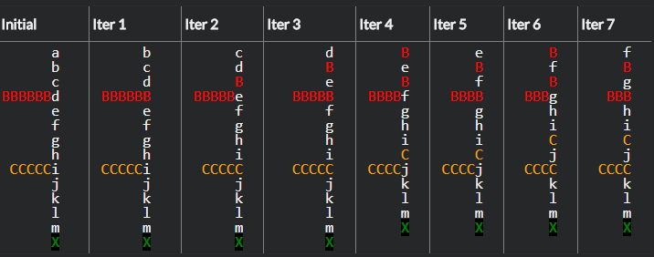

## Hurry up! Don't miss the meeting

### Description

You got mixed up in that traffic jam! YOUR CAR IDENTIFIED BY 'X'.

"I'll never get away from here!!!" - you told.

An important meeting at work will begin in T minutes (T === timeToMeeting - argument provided to the hurryUpOnMeeting function)

You're driving down the "МКАД" at V kilometres an hour (V === averageSpeed - argument provided to the hurryUpOnMeeting function)

But there was a car accident! So, you might be here a while.

And you need to calculate whether or not you can get to the meeting in time.

To calculate it you need to know:
  1) Cars are trying to enter the "МКАД" road from side-streets somewhere ahead of you and people keep letting them cut in.
  2) Each time somebody is let in the effect ripples back down the road, so pretty soon you am not moving at all.

You need to write hurryUpOnMeeting function with parameters:
  1) mainRoad (example in "Visually" section).
  2) sideStreets (example in "Visually" section).
  3) distanceToWork - distance that you need to drive to reach meeting place.
  4) averageSpeed -  average speed of your car on distanceToWork (kilometres an hour).
  5) timeToMeeting - meeting will begin in timeToMeeting (minutes).

In case YES - please return from function: "Hurrah!"
In case NO - please return an sms text: `I am running about ${neededTime} minutes late!`


### Visually
  The diagram below shows lots of cars all attempting to go "Уручье" by the road "МКАД".

  the a,b,c... cars are on the "МКАД" road with you (X)
  the B cars and C cars are merging from side streets

  ```javascript
            |  a  |   
            |  b  | ↑  
    --------+  c  |  
       BBBBBB  d  |   
    --------+  e  |  
            |  f  | ↑
            |  g  |   
    --------+  h  |
        CCCCC  i  |
    --------+  j  | ↑
            |  k  |
            |  l  |
            |  m  |
            |  X  |
  ```

  This can be represented as

  ```javascript
    mainRoad = "abcdefghijklmX"                
    sideStreets = ["","","","BBBBBB","","","","","CCCCC"]
  ```
  mainRoad and sideStreets - arguments provided to the hurryUpOnMeeting function.

### IMPORTANT NOTES
  - Assume every car on the main road will "give way" to 1 car entering from each side street
  - Each car before you - delays the finish time on 1 min.
  - Your car is the only X, and you are always on the main road
  - Other cars may be any alpha-numeric character (except X of course)
  - There are no "gaps" between cars
  - Assume side streets are always on the left (as in the diagram)
  - The sideStreets array length may vary but is never more than the length of the main road

### For example:
  Here are the first few iterations of example, showing that It's hardly moving at all...
  

  ```javascript
    hurryUpOnMeeting("abcdeXghi", ["","","CCCCC","","EEEEEEEEEE","FFFFFF","","","IIIIII"], 40, 80, 45)

    time without traffic jam - 30 minutes
    time to go through the traffic jam - 10 min (according to the result placement on the street - "abcCdCeCECX" - 10 cars before you - +10 min)

    return "Hurrah!"

    in case when traffic jam delay you for more than 15 in this case (16 cars before you) you need to return
    `I am running about 1 minutes late!`  neededTime = 1 min
  ```

#### Write your code in `src/index.js`
#### Run test locally `npm test`
